# 心语（XinYu）后端技术说明

## 一、系统总体架构

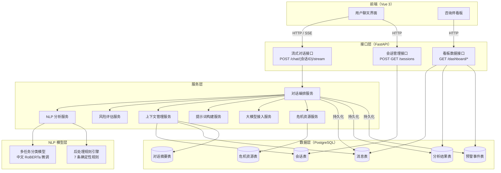

---

## 二、单轮对话处理流水线

每次用户发送消息，对话编排服务按以下顺序执行 **11 个步骤**，最终以 SSE 流式事件逐步返回结果：

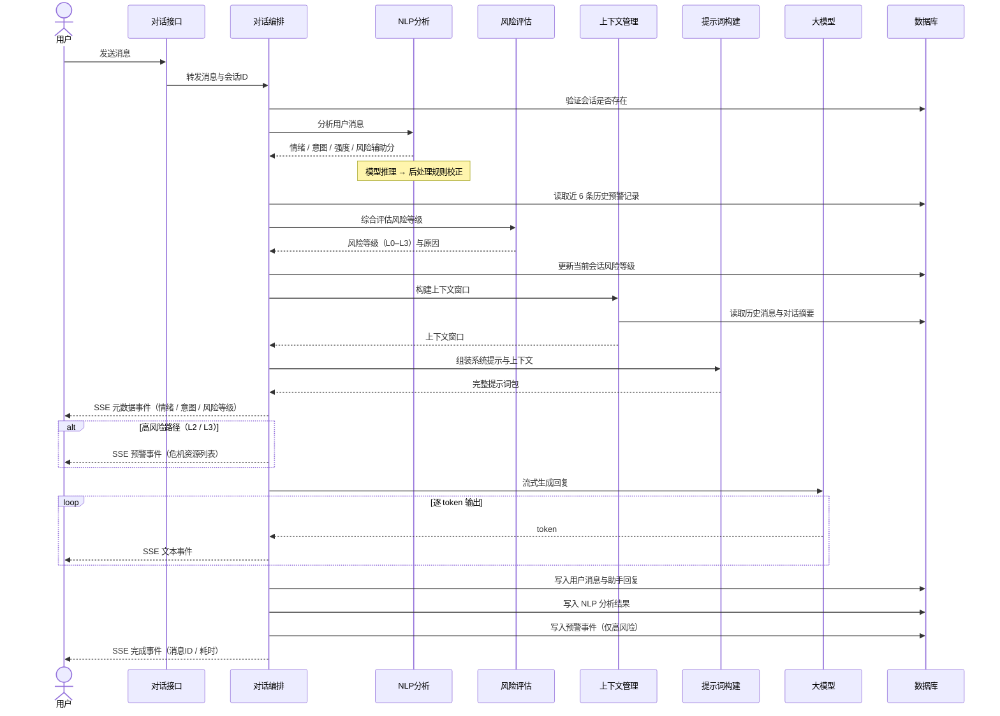

---

## 三、NLP 分析模块

### 3.1 多任务模型架构

本项目以 `hfl/chinese-roberta-wwm-ext` 为编码器，在其上训练了一个**多任务分类模型**。四个预测头共享编码器参数，对同一句输入同时输出四类结果：

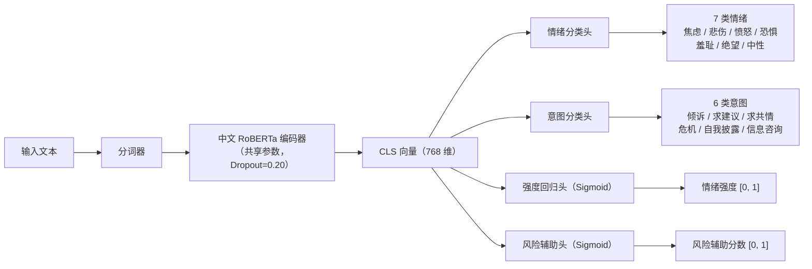

**训练配置：**

| 参数 | 值 |
|---|---|
| 基础模型 | hfl/chinese-roberta-wwm-ext |
| 训练集规模 | 3,980 条标注数据 |
| 优化器 | AdamW，学习率 2e-5，权重衰减 0.01 |
| 情绪/意图损失 | 交叉熵损失，标签平滑系数 0.10，逆频率类别权重 |
| 强度/风险损失 | 均方误差损失 / 二元交叉熵损失 |
| 学习率调度 | 前 10% 步线性预热，随后线性衰减 |

### 3.2 后处理规则引擎

模型推理完成后，规则引擎对预测结果执行**7 条确定性校正规则**，弥补模型在边界样本上的系统性混淆：

| 规则 | 触发条件 | 校正方向 |
|---|---|---|
| 规则 1 | 预测为焦虑 + 含显式恐惧词（害怕/恐惧）+ 无弥散焦虑标记 | 情绪 → 恐惧 |
| 规则 2 | 预测为恐惧 + 弥散忧虑措辞 + 无可名状具体对象 | 情绪 → 焦虑 |
| 规则 3 | 预测为羞耻 + 含外部归因词（凭什么/太不公平）+ 无自责词 | 情绪 → 愤怒 |
| 规则 4 | 预测为绝望 + 强度 < 0.62 + 无绝望语言 + 含悲伤词 | 情绪 → 悲伤 |
| 规则 5 | 含隐性危机行动框架（遗书/告别信/已经决定结束…） | 意图 → 危机 |
| 规则 6 | 预测为中性 + 含悲伤词 + 悲伤概率 ≥ 0.10 | 情绪 → 悲伤 |
| 规则 7 | 预测为自我披露 + 当下时间词 + 情绪充电词 + 倾诉概率 ≥ 0.12 | 意图 → 倾诉 |

**低置信度回退机制：** 当意图预测最高概率低于 0.50 时，系统在分析结果中标记置信度不足，提示词构建服务随即在系统提示中追加指令，要求大模型根据上下文自行判断用户意图。

### 3.3 评估结果

| 指标 | 数值 |
|---|---|
| 情绪准确率（含规则后处理）| 74.08% |
| 情绪宏平均 F1 | 74.02% |
| 意图准确率（含规则后处理）| 80.41% |
| 意图宏平均 F1 | 82.14% |
| 风险召回率 | 80.00% |
| 危机安全探针（30 条）| **30/30 全部通过** |

---

## 四、风险评估模块

风险评估服务为**纯函数式无状态模块**，综合五类信号输出 L0–L3 四级风险评估：

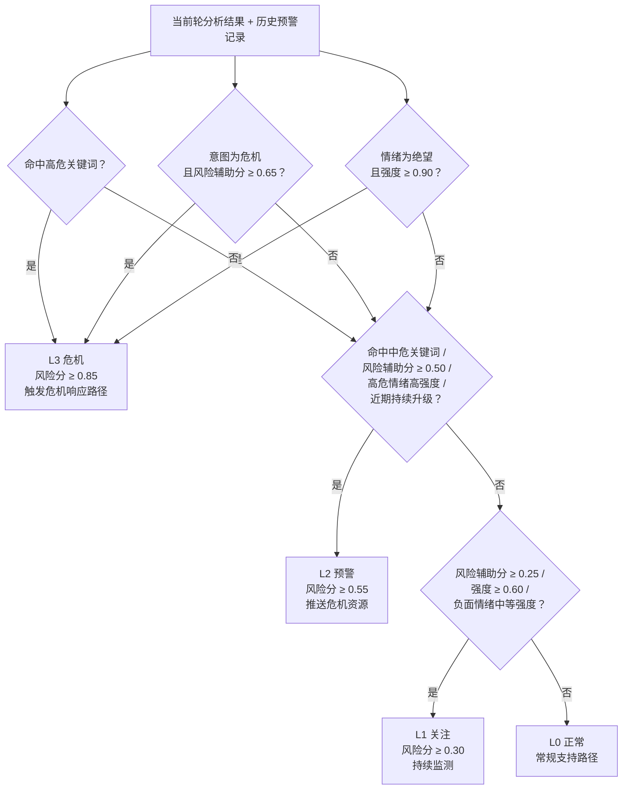

**跨轮次升级检测：** 对话编排服务在每轮开始前从数据库读取近 6 条历史预警记录，若其中 ≥ 2 条为高风险（L2/L3），则判定为持续升级态势，触发 L2 预警——即使当前轮次未命中任何关键词。

---

## 五、多轮对话上下文管理

上下文管理服务实现**三层压缩架构**，解决长对话中大模型 Token 窗口有限的问题：

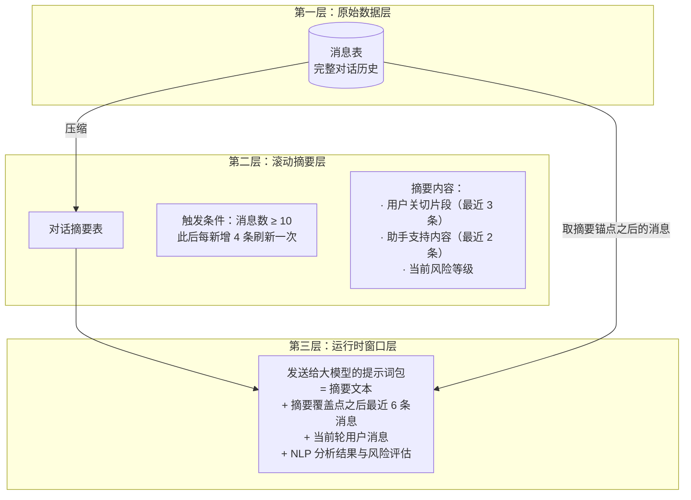

摘要以**覆盖锚点消息 ID** 标记已压缩位置，每次刷新只处理锚点之后的增量消息，避免重复计算。若锚点丢失则强制重建摘要。

---

## 六、提示词动态构建

提示词构建服务根据**风险等级**和**分类置信度**动态组装发送给大模型的系统提示：

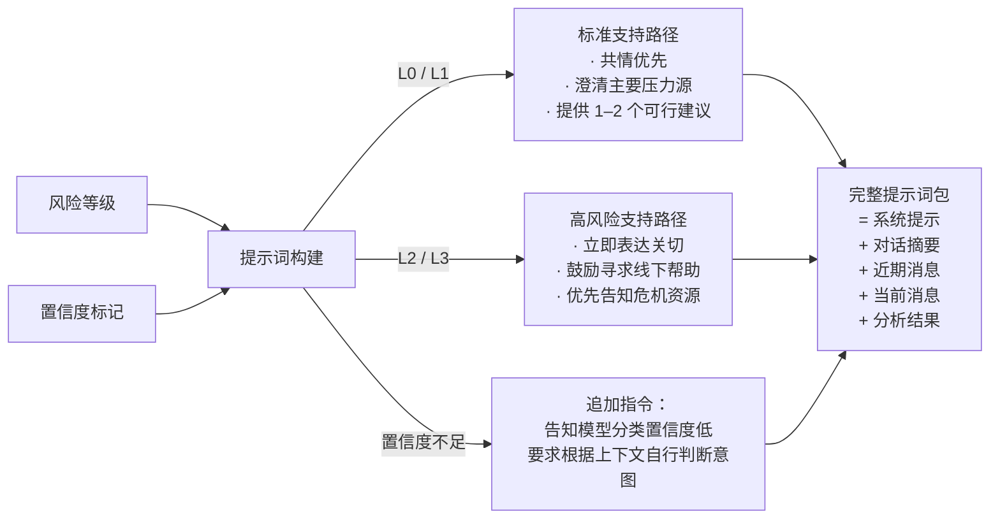

---

## 七、数据库设计

系统共 8 张表，全部由数据库迁移脚本统一创建和管理：

- **第一次迁移**：建立全部 8 张核心业务表
- **第二次迁移**：为访客档案表新增 `username`、`password_hash` 两列，支持账号注册登录
- **第三次迁移**：为访客档案表新增 `real_name`、`college`、`student_id`、`is_guest` 四列；为咨询师账户表新增 `display_name`、`college` 两列，支持多学院权限隔离

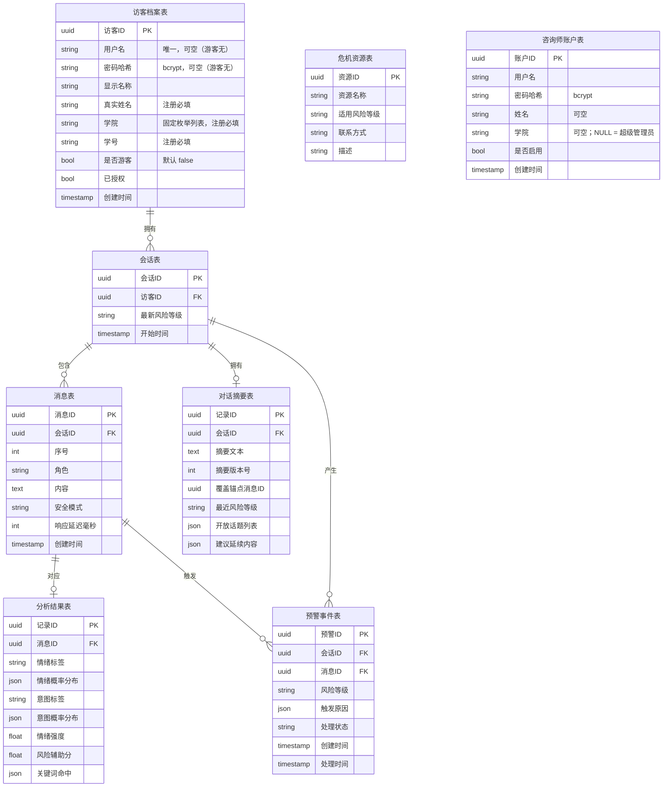

---

## 八、咨询师看板接口

看板模块提供 12 个接口，供咨询师实时监控对话状态并管理账户权限。所有接口按调用者的学院字段自动过滤数据（见第十二章）：

| 接口 | 权限 | 功能 |
|---|---|---|
| 统计概览 | 咨询师 | 汇总总会话数、总消息数、未处理预警数、危机预警数 |
| 图表数据 | 咨询师 | 情绪标签分布（按消息聚合）+ 风险等级分布（按会话聚合）|
| 会话列表 | 咨询师 | 所有可见会话，含学生信息、消息数、主导情绪、最高风险等级 |
| 会话消息 | 咨询师 | 指定会话的全量消息，每条附带 NLP 分析结果 |
| 预警列表 | 咨询师 | 所有可见预警事件，含触发原因与处理状态 |
| 更新预警状态 | 咨询师 | 将预警状态从"待处理"更新为"已确认"或"已解决" |
| 学生档案列表 | 咨询师 | 列出所有注册学生（非游客），含学号、学院、会话数、最高风险等级 |
| 学生档案详情 | 咨询师 | 指定访客的详细信息及最近 20 条会话摘要 |
| 数据导出 | 咨询师 | 生成 Excel 文件，含"会话列表"和"预警记录"两个工作表 |
| 咨询师列表 | 超级管理员 | 查看所有咨询师账户及其状态 |
| 创建咨询师 | 超级管理员 | 为指定学院创建咨询师账户（学院从固定列表选择）|
| 切换咨询师状态 | 超级管理员 | 启用或停用学院咨询师账户（不可操作超管自身）|

---

## 九、服务组装与依赖注入

所有服务在应用启动时**一次性组装**为不可变容器，通过框架依赖注入机制传递给各路由处理函数，避免在请求处理中直接实例化服务：

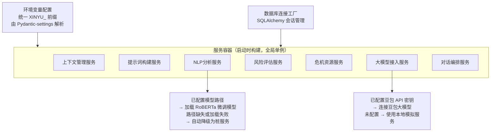

---

## 十、身份认证系统

### 10.1 整体设计

系统针对四类用户采用差异化的认证策略：

| 用户类型 | 获取方式 | 认证方式 | 令牌有效期 | 可访问资源 |
|---|---|---|---|---|
| 游客 | 一键创建匿名档案 | 无需账号 → JWT | 24 小时 | 匿名聊天（无历史记录）|
| 注册访客 | 开放自助注册（必填真实姓名、学院、学号）| 用户名 + 密码 → JWT | 7 天 | 会话管理、聊天、历史记录 |
| 学院咨询师 | 超级管理员在后台创建 | 用户名 + 密码 → JWT | 7 天 | 本学院学生 + 匿名访客的看板数据 |
| 超级管理员 | 命令行种子脚本预置（`college` 为空）| 用户名 + 密码 → JWT | 7 天 | 全量看板数据 + 咨询师账户管理 |

### 10.2 认证流程

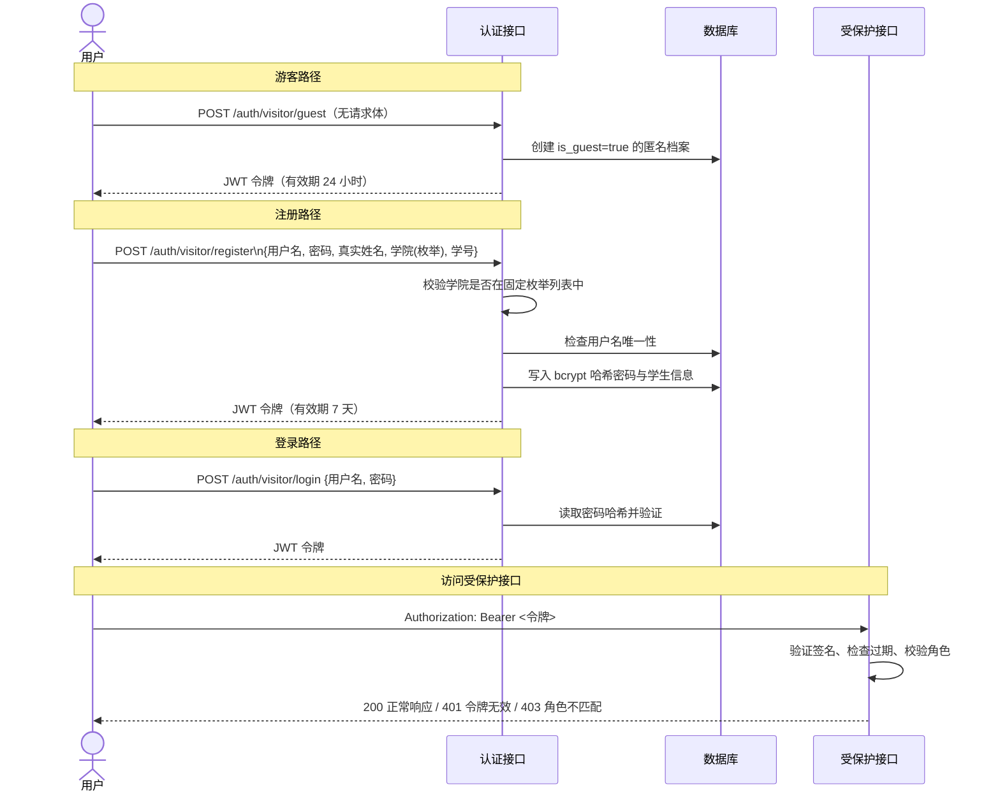

### 10.3 JWT 结构与接口保护策略

**令牌载荷：**
```
{ "sub": "用户ID", "role": "visitor | counselor", "exp": 过期时间戳 }
```
使用 HS256 算法签名，密钥通过 `XINYU_JWT_SECRET_KEY` 环境变量注入。

**接口保护范围：**

```mermaid
graph LR
    subgraph 无需认证
        健康检查["GET /health"]
        游客登录["POST /auth/visitor/guest"]
        访客注册["POST /auth/visitor/register"]
        访客登录["POST /auth/visitor/login"]
        咨询师登录["POST /auth/counselor/login"]
    end

    subgraph 需要访客JWT
        创建会话["POST /sessions"]
        会话列表["GET /sessions"]
        查看会话["GET /sessions/{id}\n（仅本人）"]
        发送消息["POST /chat/{id}/stream\n（仅本人会话）"]
    end

    subgraph 需要咨询师JWT（结果按学院过滤）
        看板统计["GET /dashboard/stats"]
        图表数据["GET /dashboard/charts"]
        所有会话["GET /dashboard/sessions"]
        会话消息["GET /dashboard/sessions/{id}/messages"]
        预警列表["GET /dashboard/alerts"]
        更新预警["PATCH /dashboard/alerts/{id}"]
        学生档案["GET /dashboard/visitors"]
        学生详情["GET /dashboard/visitors/{id}"]
        数据导出["GET /dashboard/export"]
    end

    subgraph 需要超级管理员JWT
        咨询师列表["GET /dashboard/counselors"]
        创建咨询师["POST /dashboard/counselors"]
        切换状态["PATCH /dashboard/counselors/{id}"]
    end
```

**会话归属校验：** 访客访问自己的会话和聊天接口时，后端额外校验 `session.visitor_id == jwt.sub`，防止横向越权。

**学院归属校验：** 咨询师访问学生档案详情时，后端校验 `visitor.college == counselor.college`（超级管理员无此限制）。

---

## 十一、情绪轨迹追踪

### 11.1 问题背景

单轮 NLP 分析只能反映当前消息的情绪状态，无法感知用户在多轮对话中的**情绪变化走向**。例如：用户在第 1 轮表达极度压力（绝望），但在第 3 轮开始自我宽慰，系统的回应方式应随之调整——既不应忽视改善，也不应继续强调负面。

### 11.2 实现机制

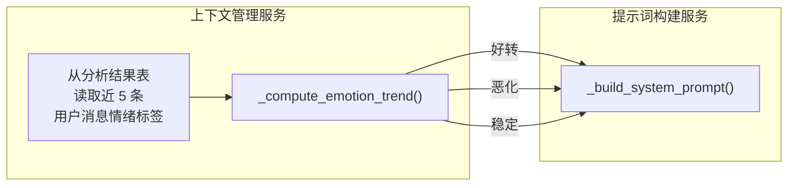

### 11.3 情绪严重度映射与走向判断

每种情绪标签映射到一个 0–3 的严重度分值：

| 严重度 | 情绪标签 |
|---|---|
| 0 | 平静（中性）|
| 1 | 焦虑、恐惧 |
| 2 | 悲伤、愤怒、羞耻 |
| 3 | 绝望 |

**走向计算逻辑**（需至少 3 条历史记录）：

- 取历史序列中前（N−2）条的平均严重度 `early_avg`
- 取最近 2 条的平均严重度 `recent_avg`
- `recent_avg > early_avg + 0.5` → **恶化**
- `recent_avg < early_avg − 0.5` → **好转**
- 其余 → **稳定**

### 11.4 系统提示适配示例

| 走向 | 追加到系统提示的内容 |
|---|---|
| 好转 | 对话记录显示用户情绪已从「焦虑 → 悲伤 → 平静」逐步好转。请肯定用户的积极变化，避免过度强调负面状态，以支持其继续向好的方向发展。|
| 恶化 | 对话记录显示用户情绪持续加重（焦虑 → 悲伤 → 绝望）。请以更多耐心和关注回应，适时评估是否需要升级支持力度。|
| 稳定 | （无追加内容）|

---

## 十二、多学院权限隔离与后台管理

### 12.1 设计目标

系统定位为校园心理健康服务平台，支持多学院并行使用：各学院咨询师只能查看和导出本学院学生的数据；超级管理员（通常为学生心理健康教育中心）拥有全量数据访问权和咨询师账户管理权。

### 12.2 权限隔离逻辑

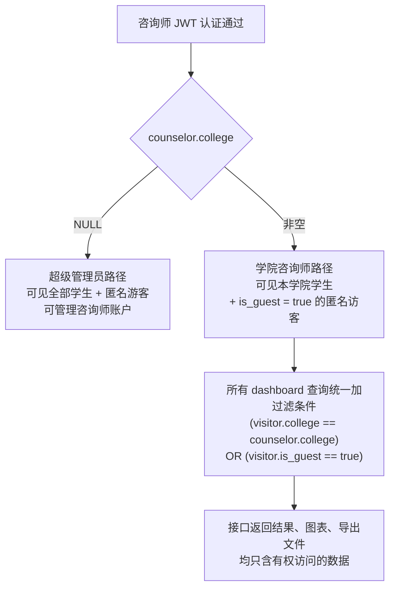

过滤逻辑在后端统一实现，前端无需感知——无论是统计卡片、图表、会话列表、预警记录还是 Excel 导出，均经过同一条件过滤，不存在数据泄露通道。

### 12.3 学院名称固定枚举

注册时用户从前端下拉菜单选择学院，不允许手动输入。原因在于：**学院字段同时作为权限边界**，若允许自由填写，拼写差异（"计算机学院" vs "计算机科学学院"）会导致权限隔离失效——咨询师的 `college` 字段和学生的 `college` 字段无法精确匹配，本该可见的学生会被漏掉。

固定枚举列表在前端（`frontend/src/constants.ts`）和后端（`backend/app/core/colleges.py`）双端维护，注册接口对传入值做服务端二次校验，传入枚举外的值返回 422 错误。

### 12.4 超级管理员后台

超级管理员登录后，看板右侧显示"管理员设置"标签页，提供两项功能：

**添加学院咨询师**：填写用户名、密码、所属学院（下拉选择）、姓名（可选），提交后立即生效。创建的账户学院字段非空，系统自动识别为学院咨询师。

**咨询师账户列表**：展示所有账户的用户名、姓名、学院、权限类型（超级管理员 / 学院咨询师）、当前状态。对学院咨询师账户可一键启用/停用（软删除设计，停用账户的令牌立即失效）；超级管理员账户不可从 UI 停用，防止误操作锁死系统。

超级管理员账户本身由服务器端种子脚本创建（`college` 字段留空），不经过任何公开接口，确保最高权限账户的创建路径与业务接口完全隔离。
